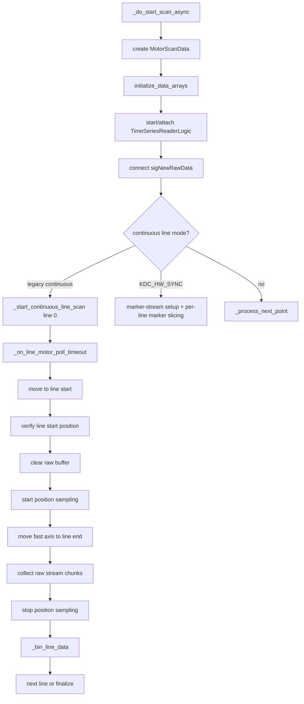

# Motor XY Scan Module

Reference for the motor-based XY scanning subsystem in
`qudi.logic.motor_scan`, used for motorized 1D/2D scans with synchronous data
acquisition (primarily Thorlabs MTS50/KDC101 stages and Red Pitaya streaming).

This document covers the module architecture, configuration, the scan execution
flows for all modes, and the continuous line-scanning and binning.

## Source files

| Component | Path |
|-----------|------|
| Logic package | `src/qudi/logic/motor_scan/` |
| GUI | `src/qudi/gui/motor_scan/motor_scan_gui.py` |
| Motor interface | `src/qudi/interface/motor_interface.py` |
| Thorlabs hardware | `src/qudi/hardware/motor/thorlabs_kdc101_kinesis.py` |
| Other motor hardware | `src/qudi/hardware/motor/` (Newport, PI, Zaber, Micos) |
| Dummies | `src/qudi/hardware/dummy/motor_dummy.py`, `src/qudi/hardware/dummy/motor_scan_dummy.py` |
| Time-series source | `src/qudi/logic/time_series_reader_logic.py` |
| Red Pitaya streamer | `src/qudi/hardware/redpitaya/redpitaya_data_instream.py` |
| Fit functions | `my_software/tools/fitting.py` |
| Example config | `config_examples/example_motor_scan.cfg` |

### Logic package structure

```text
motor_scan/
├── __init__.py             # Re-exports ScanMode/ScanPattern/ScanState/MotorScanData/MotorScanLogic
├── scan_logic.py           # MotorScanLogic: main class, orchestrates all modes
├── data_structures.py      # ScanMode, ScanPattern, ScanState enums + MotorScanData dataclass
├── hw_sync_scan.py         # HwSyncScanMixin: KDC/FPGA hardware-marker scans
├── continuous_line_scan.py # ContinuousLineScanMixin: line-by-line continuous scanning
├── motor_control.py        # MotorControlMixin: movement, homing, position sampling
├── data_processing.py      # DataProcessingMixin: ODMR fitting, stream callbacks, line binning
├── data_saving.py          # DataSavingMixin: file I/O, figure generation
└── data_loading.py         # DataLoadingMixin: load saved STEP_ODMR scans for re-display
```

## Overview and scan modes

`MotorScanLogic` supports five acquisition modes (`ScanMode` in
`data_structures.py`):

| Mode | Value | Description |
|------|-------|-------------|
| `CONTINUOUS_STREAM` | 0 | Motor moves continuously; streaming channel data binned to grid by position |
| `STEP_ODMR` | 1 | Stop at each point, run an ODMR scan, fit, store results |
| `CONTINUOUS_FREQ_TRACK` | 2 | Motor moves continuously; absolute frequency recorded from the lock |
| `POSITION_ONLY` | 3 | Stage movement along the pattern only, no data acquisition (debug/alignment) |
| `KDC_HW_SYNC` | 4 | Motor moves continuously; KDC trigger markers slice the FPGA stream by hardware sample index |

Scan patterns (`ScanPattern`) determine grid visiting order and the fast axis:

| Pattern | Value | Meaning |
|---------|-------|---------|
| `LINE_BY_LINE_X` | 0 | Fast axis X, return to x-start each new line |
| `SNAKE_X` | 1 | Fast axis X, alternate direction (boustrophedon) — default |
| `LINE_BY_LINE_Y` | 2 | Fast axis Y, return to y-start each new line |
| `SNAKE_Y` | 3 | Fast axis Y, alternate direction |

Snake patterns avoid the long return move between lines:

```text
LINE_BY_LINE_Y                 SNAKE_Y
x line 0: y0 -> yN (return)    x line 0: y0 -> yN
x line 1: y0 -> yN (return)    x line 1: yN -> y0
x line 2: y0 -> yN (return)    x line 2: y0 -> yN
```

## Module architecture

`MotorScanLogic` is assembled from mixins. **Inheritance order matters**:
`HwSyncScanMixin` provides the hardware-marker hooks, and
`ContinuousLineScanMixin` precedes `MotorControlMixin` so it can override
movement-related behaviour.

```python
class MotorScanLogic(HwSyncScanMixin,
                     ContinuousLineScanMixin,
                     MotorControlMixin,
                     DataProcessingMixin,
                     DataSavingMixin,
                     DataLoadingMixin,
                     LogicBase):
```

| Mixin | Responsibility |
|-------|----------------|
| `HwSyncScanMixin` | KDC trigger setup, FPGA marker-stream drain, marker reconstruction |
| `ContinuousLineScanMixin` | Continuous line-by-line state machine |
| `MotorControlMixin` | Homing, manual movement, position sampling |
| `DataProcessingMixin` | Stream callbacks, ODMR fitting, line binning |
| `DataSavingMixin` | Saved maps, `positions.dat`, thumbnails |
| `DataLoadingMixin` | Loading saved STEP_ODMR scans for re-display |

### Connectors

| Connector | Interface | Required? | Used by |
|-----------|-----------|-----------|---------|
| `motor_hardware` | `MotorInterface` | required | all modes |
| `odmr_logic` | `LogicBase` | optional | `STEP_ODMR` |
| `time_series_logic` | `LogicBase` | optional | `CONTINUOUS_STREAM`, `CONTINUOUS_FREQ_TRACK` |
| `odmr_frequency_tracking_logic` | `LogicBase` | optional | `CONTINUOUS_FREQ_TRACK` |
| `streamer` | `DataInStreamInterface` | optional | `KDC_HW_SYNC` Red Pitaya stream handover / live tap |

`_do_start_scan_async()` validates that the connector(s) required for the
selected mode are present before starting, and aborts with a logged error
otherwise.

### Non-blocking / threaded design

All scan operations are non-blocking so the GUI event loop stays responsive.
Public entry points emit internal queued signals that run on the logic thread:

```text
start_scan()  → _sigDoStartScan (QueuedConnection) → _do_start_scan_async()
home_stages() → _sigDoHoming    (QueuedConnection) → _do_homing_async()
move_to_position() → _sigDoMove (QueuedConnection) → _do_move_async()
```

Motor progress is then driven by single-shot `QTimer` polling rather than
blocking waits.

| Mechanism | Purpose |
|-----------|---------|
| `RecursiveMutex` (`_thread_lock`) | Protects all state modifications |
| Qt `QueuedConnection` | All cross-thread signal/slot connections |
| `module_state.lock()` | Qudi framework lock held during a scan |

**Rule:** all public `@Slot` methods acquire `_thread_lock` at entry.

## Configuration

Use `config_examples/example_motor_scan.cfg` as the starting point — it contains
both a hardware config and a fully wired dummy config for testing without
hardware. The hardware `module.Class` is
`motor.thorlabs_kdc101_kinesis.ThorlabsKDC101Kinesis`; the logic is
`motor_scan.scan_logic.MotorScanLogic`; the GUI is
`motor_scan.motor_scan_gui.MotorScanGui`.

Key `MotorScanLogic` config options (see `scan_logic.py` for the full list and
defaults):

| Option | Default | Notes |
|--------|---------|-------|
| `default_scan_mode` | `'STEP_ODMR'` | Initial mode (string name or int value) |
| `continuous_line_mode` | `True` | Use line-by-line continuous scanning; `False` falls back to point-by-point for continuous modes |
| `position_sample_interval` | `0.05` | Position sampling period during a continuous line (≈20 Hz) |
| `position_poll_interval` | `0.05` | Motor movement poll period (50 ms) |
| `odmr_fit_function` | `'fit_hyperfine'` | Fit function from `my_software.tools.fitting` |
| `require_homed_before_scan` | `True` | Refuse to start until axes report a valid home reference |
| `home_before_scan` | `False` | Home automatically before each scan |
| `save_odmr_fit_plots` | `True` | Save per-pixel fit PDFs during STEP_ODMR |
| `auto_save_on_completion` | `True` | Save scan data automatically when a scan completes |
| `lock_status_poll_interval` | `0.5` | Lock-status poll period during `CONTINUOUS_FREQ_TRACK` |
| `redpitaya_hostname` | `None` | Hostname for the shared pyrpl instance used by `KDC_HW_SYNC` |
| `redpitaya_config_name` | `None` | pyrpl config name for the shared Red Pitaya |
| `hw_sync_channel` | `'demod'` | FPGA marker stream input, `'demod'` or `'ftw_corr'` |
| `hw_sync_pulse_width` | `1e-4` | Fast-axis KDC position-step pulse width |
| `hw_sync_trig_port` | `1` | KDC101 TRIG SMA port used for hardware markers |
| `hw_sync_margin_frac` | `0.5` | Fast-axis over-travel margin in bin widths |
| `hw_sync_runup` | `0.5e-3` | Extra fast-axis run-up before the first real boundary |
| `save_full_traces` | `False` | For `KDC_HW_SYNC`, persist full demod trace and per-bin traces |

Persistent state (`StatusVar`): `scan_ranges`, `scan_resolution`,
`active_scan_mode`, `active_scan_pattern`, `save_full_traces`.

### Minimal API example

```python
logic = motor_scan_logic
logic.set_scan_ranges({'x': (0.0, 0.01), 'y': (0.0, 0.01)})  # 10 mm × 10 mm
logic.set_scan_resolution({'x': 20, 'y': 20})                # 20 × 20 grid
logic.set_scan_mode('STEP_ODMR')
logic.start_scan()
```

## Scan execution flows

### Scan setup (`_do_start_scan_async`, all modes)

1. Refuse to start if a manual move is in progress or the motor is still moving.
2. If `home_before_scan`, home the axes; abort on homing failure.
3. If `require_homed_before_scan`, verify a valid home reference.
4. Validate the connector(s) required for the selected mode.
5. Build the `MotorScanData` object (axes, range, resolution, mode, pattern).
6. `initialize_data_arrays()` for the channels relevant to the mode.
7. For legacy stream modes, start or attach to `TimeSeriesReaderLogic` and
   connect `sigNewRawData` -> `_on_new_raw_data()`. For `KDC_HW_SYNC`, acquire
   the pyrpl scan module, start marker streaming, and configure the KDC triggers.
8. Lock module state, set `RUNNING`, then start either continuous-line scanning
   (`_should_use_continuous_line_mode()` true) or point-by-point
   (`_sigNextPoint.emit()`).

`_should_use_continuous_line_mode()` returns true for `CONTINUOUS_STREAM`,
`CONTINUOUS_FREQ_TRACK`, `POSITION_ONLY`, and `KDC_HW_SYNC` when
`continuous_line_mode` is enabled (the default). `STEP_ODMR` always uses
point-by-point.

### STEP_ODMR

| Aspect | Behaviour |
|--------|-----------|
| Motion | Point-by-point: stop at every grid point before measuring. |
| Data source | `odmr_logic`; each point runs a full ODMR scan. |
| Storage | Fit results go into `center_frequency`, `linewidth`, `splitting`, and `fit_quality`; optional raw ODMR and fit PDFs are saved per pixel. |
| Timing risk | Slow but robust: data is acquired only after the motor is stationary at the target. |

Execution:

1. `_process_next_point()` sends `motor.move_abs(target)`.
2. `_motor_poll_timer` calls `_on_motor_poll_timeout()` until the motor is idle
   and within `_POINT_POSITION_TOLERANCE` (100 um).
3. A false-idle or short move is retried up to `_POINT_MOVE_MAX_RETRIES`.
4. `_start_odmr_scan_async()` starts the ODMR measurement and waits for
   `sigScanStateUpdated`.
5. The selected fit function (`fit_hyperfine` / `fit_odmr_robust`) extracts the
   point result.
6. `_advance_to_next_point()` moves through the grid; the final point calls
   `_finalize_scan(completed=True)` and emits `sigScanCompleted`.

### Legacy Continuous Modes

This group covers `CONTINUOUS_STREAM`, `CONTINUOUS_FREQ_TRACK`, and
`POSITION_ONLY` when `continuous_line_mode` is enabled.

| Mode | Data source | Result |
|------|-------------|--------|
| `CONTINUOUS_STREAM` | `TimeSeriesReaderLogic.sigNewRawData` | Per-channel mean map plus optional raw samples per bin |
| `CONTINUOUS_FREQ_TRACK` | Frequency-tracking correction stream | Absolute-frequency map, with lock-loss pause/resume handling |
| `POSITION_ONLY` | None | Stage follows the scan pattern for debug/alignment |

All three use the same two-phase line motion:

1. Move to line start:
   `motor.move_abs(line_start)` and poll until idle and within
   `_LINE_START_POSITION_TOLERANCE` (500 um). The line-start move is retried up
   to `_LINE_START_MAX_RETRIES`, with `_LINE_START_TIMEOUT` as an overall guard.
2. Sweep the fast axis:
   clear the per-line raw buffer, start software position sampling, command only
   the fast axis to `line_end`, and poll until the sweep finishes.
3. Finish the line:
   stop position sampling. Stream modes call `_bin_line_data()` to align raw
   samples to grid bins using software-timed encoder samples; `POSITION_ONLY`
   skips binning.
4. Finalize:
   disconnect time-series signals, stop `TimeSeriesReaderLogic` if this scan
   started it, auto-save if configured, and emit `sigScanCompleted`.

### KDC_HW_SYNC

`KDC_HW_SYNC` uses the same non-blocking line state machine as the legacy
continuous modes, but it replaces software position-sampling binning with FPGA
marker slicing.

| Aspect | Behaviour |
|--------|-----------|
| Motion | Continuous line sweeps with over-travel/run-up around the fast-axis bin boundaries. |
| Data source | pyrpl scan module marker stream: `mapped_stream_read()`, `read_x_markers()`, `read_y_markers()`. |
| Fast-axis boundary | KDC "At Position Steps" trigger; one marker per bin boundary. |
| Slow-axis boundary | KDC `out_in_motion` trigger; one marker at the start of each row transition. |
| Storage | Mean map plus marker arrays; optional full demod trace and per-bin traces when `save_full_traces` is true. |

Setup:

1. Get the shared pyrpl scan module and initialize one stream channel
   (`demod` or `ftw_corr`).
2. Configure the slow-axis KDC TRIG as `out_in_motion`.
3. Start marker streaming with
   `scan.mapped_stream_start(input_source=hw_sync_channel)`.
4. Run one discarded fast-axis warm-up sweep.

Per line:

1. Move to the line start / slow-axis row.
2. Configure the fast-axis KDC "At Position Steps" trigger for that line's bin
   boundaries. A leading throwaway pulse absorbs the first-pulse drop observed
   on hardware.
3. Drain demod samples and x/y marker rings on every poll, including inter-line
   motion.
4. Sweep the fast axis continuously.
5. Reconstruct the row from x-marker sample indices.

Finalize:

1. Stop marker streaming and disable KDC triggers.
2. Store the demod/marker arrays on `MotorScanData`.
3. Re-bin the whole trace from x/y hardware markers when y markers pass sanity
   checks. If they do not, keep the live software-sequenced map and log that the
   slow-axis hardware guarantee was incomplete.

### Lock-loss handling (CONTINUOUS_FREQ_TRACK)

Lock status is polled every `lock_status_poll_interval` (500 ms). On lock loss:
emit `sigLockLostDuringScan`, transition to `PAUSED`. The user re-establishes the
lock and calls `resume_scan()`; the zero-crossing history is updated and the line
resumes.

## Continuous line scanning in depth

This section describes the legacy software-binned continuous modes
(`CONTINUOUS_STREAM` and `CONTINUOUS_FREQ_TRACK`). `KDC_HW_SYNC` still uses the
line state machine for motion orchestration, but it does **not** use the position
sampling buffer, `sigNewRawData`, or `_bin_line_data()` for its primary data
assignment. It drains the pyrpl marker stream directly and slices by FPGA sample
indices instead.

### Concept

The motor moves continuously along the fast axis of each line; the data stream
is collected during the move and binned to grid points *after* the line
finishes. The logic does not stop at each grid point. It reconstructs which
samples belong to which grid point from:

1. Encoder position samples collected during the line (~20 Hz, software-timed).
2. A constant-rate raw data stream (~30 kHz from the Red Pitaya).
3. The nominal grid positions and their bin boundaries.

Core call graph for the legacy software-binned path:



### Line state machine

Implemented in `continuous_line_scan.py`. Two phases per line:

```text
Phase 1: Move to line start
  _start_continuous_line_scan() → motor.move_abs(start_pos)
  timer polls _on_line_motor_poll_timeout() until idle
  verify actual position within _LINE_START_POSITION_TOLERANCE (500 µm)

Phase 2: Scan to line end
  clear motor-scan raw data buffer
  set _line_data_start_time
  start position sampling
  motor.move_abs({fast_axis: line_end_position})
  poll while moving
  stop position sampling, copy raw data buffer
  _bin_line_data()
```

```text
time ------------------------------------------------------------->
move to line start      continuous fast-axis move        binning
|------------------|    |--------------------------|     |-----|
                        ^                          ^
                        line data start            motor idle at line end
                        clear raw buffer
                        start position sampling
raw data callback:      [chunk][chunk][chunk][chunk][chunk]
position sampling:      p0    p1    p2    p3    p4    p5
```

`_resume_continuous_line()` resumes a paused line and uses
`_position_sample_interval` rather than `_position_poll_interval`.

### Position sampling (`motor_control.py`)

The position buffer is a list of `(timestamp_seconds, {"x": x_m, "y": y_m})`.
Timestamps are relative to the line start and are taken in software around the
`get_pos()` call — there is no hardware-synchronized clock. The sample rate
(~20 Hz) is far slower than the data stream, so positions are used only to find
boundary-crossing times, not to time-stamp individual stream samples.

Key methods: `_start_position_sampling(sample_interval_ms, preserve_buffer)`,
`_record_position_sample()`, `_stop_position_sampling()`.

### Raw stream data flow (CONTINUOUS_STREAM)

```mermaid
flowchart LR
    RP[Red Pitaya FPGA stream] --> RPHW[RedPitayaDataInStream]
    RPHW --> TSR[TimeSeriesReaderLogic]
    TSR -->|sigNewRawData(data, times)| MS[MotorScanLogic]
    MS --> BUF[_ts_raw_data_buffer]
    BUF --> BIN[_bin_line_data after line end]
    BIN --> MEAN[stream_data_mean]
    BIN --> RAW[stream_data_raw per grid point]
```

`sigNewRawData` emits the **raw** samples read from the streamer (GUI trace
processing, oversampling reduction, and moving average happen inside
`TimeSeriesReaderLogic` and are *not* applied to what motor scan receives).

`_on_new_raw_data(data_buffer, times_buffer)` returns immediately unless the scan
is running in `CONTINUOUS_STREAM` or `CONTINUOUS_FREQ_TRACK`, gets
`active_channel_names`, de-interleaves the buffer
(`[ch1_s0, ch2_s0, ch1_s1, ...]` -> per-channel lists), and appends to
`_ts_raw_data_buffer[channel]`. **`times_buffer` is ignored** by this legacy
path: motor scan does not store per-sample timestamps.

For the Red Pitaya streamer in this repo:

- Sample timing is constant-rate at ≈`125 MHz / 4096 ≈ 30517.6 Hz`.
- Timestamp buffers are not supported; reads return `None` for timestamps.
- A software circular buffer sits between FPGA polling and `TimeSeriesReaderLogic`;
  overflow drops samples and logs a warning.

### Binning algorithm (`_bin_line_data`)

```mermaid
flowchart TD
    A[get line point indices] --> B[get bin boundaries from nominal grid]
    B --> C[extract fast-axis position vs time]
    C --> D[trim stationary samples at start/end]
    D --> E[interpolate position -> time]
    E --> F[compute boundary crossing times]
    F --> G[sample times = arange(n)/sample_rate]
    G --> H[searchsorted boundary times into sample times]
    H --> I[mean samples in each bin]
    I --> J[write stream_data_mean and stream_data_raw]
```

**Bin boundaries** (`MotorScanData.get_bin_boundaries`): `N+1` boundaries for `N`
grid points. Internal boundaries are midpoints between grid points; the first and
last are extrapolated half a step beyond the end points:

```text
b0 = p0 - step/2
b1 = (p0 + p1) / 2
...
bN = p(N-1) + step/2
```

For a reverse-direction line the boundaries are reversed, then boundary *times*
are sorted so sample indices stay increasing in time.

**Position→time interpolation**: stationary samples at the start/end are trimmed
(constant position breaks `interp1d`, and covers USB latency before the move
begins / after arrival). A linear `interp1d(position → time)` then estimates when
the motor crossed each boundary.

**Sample times**: constructed as `np.arange(n_samples) / sample_rate`.
`sample_rate` is taken from `ts_logic.data_rate` if available, else `30000.0`.
Note the distinction:

```text
TimeSeriesReaderLogic.sampling_rate = raw hardware stream rate
TimeSeriesReaderLogic.data_rate     = sampling_rate / oversampling_factor
```

Because `sigNewRawData` carries raw samples, binning should use the raw sample
rate. If `oversampling_factor > 1` and `data_rate` is used, the sample-time axis
is stretched by that factor (see Known Weak Points).

**Assigning samples to bins**:

```python
boundary_sample_indices = np.searchsorted(sample_times, boundary_times)
# bin i = raw_array[boundary_sample_indices[i] : boundary_sample_indices[i+1]]
```

The mean per bin is written to `stream_data_mean[channel][grid_idx]`; the raw
samples to `stream_data_raw[channel][point_idx]`.

## KDC hardware-sync marker path

`KDC_HW_SYNC` uses `pyrpl.hardware_modules.scan` marker streaming instead of the
time-series callback. The Red Pitaya scan module is put into marker-stream mode
with `mapped_stream_start(input_source=hw_sync_channel)`, which enables the
stream ring and marker capture in the FPGA. The scan drains:

- demod or `ftw_corr` samples via `mapped_stream_read()`;
- fast-axis/bin marker indices via `read_x_markers()`;
- slow-axis/line marker indices via `read_y_markers()`.

All three are in one absolute sample-index space. The FPGA writes the current
stream sample counter into the marker ring on each captured KDC trigger edge, so
the marker value itself is the slice boundary in the continuous demod array.
Push streaming NaN-fills dropped sample ranges, preserving this absolute index
alignment even if the PC stalls.

### Trigger roles

The FPGA input names are `x_pos_trig_i` and `y_pos_trig_i`, but the current qudi
logic role-maps them to the scan pattern:

| Role | Hardware source | Purpose |
|------|-----------------|---------|
| Fast-axis/bin marker | KDC "At Position Steps" output | `ppl + 1` real bin boundaries per line |
| Slow-axis/line marker | KDC `out_in_motion` output | one row-boundary edge per slow-axis move |

For `LINE_BY_LINE_X` and `SNAKE_X`, x markers are bins and y markers are lines.
For `LINE_BY_LINE_Y` and `SNAKE_Y`, the roles are swapped internally so the
fast-axis ring still defines bins and the slow-axis ring still defines line
separators.

### Reconstruction

The live line path calls `reconstruct_hw_sync_line(scan_data, demod, line_xm,
line_index, ...)`. For `ppl` points per line, `ppl + 1` boundary markers produce
`ppl` bins:

```python
bin_k = demod[xm[k] : xm[k + 1]]
```

At finalize, `_hw_sync_finalize()` stores the faithful dataset on
`MotorScanData` (`hw_demod_trace`, `hw_x_markers`, `hw_y_markers`) and then tries
to re-bin the whole trace with `reconstruct_hw_sync_scan(...)`. If the slow-axis
markers are missing, bunched, or produce empty lines, finalize keeps the live
software-sequenced map and logs that the slow-axis boundary guarantee was not
complete for that scan.

### Stream handover

The Red Pitaya has one stream ring and one sample counter. If the time-series GUI
or frequency-tracking monitor is already reading the stream, `KDC_HW_SYNC` asks
`redpitaya_data_instream.begin_scan_stream()` to hand ownership to the marker
scan and expose a non-stealing tap for the live display. `end_scan_stream()`
stops marker mode and restores the standalone monitor stream.

## Data storage

`DataSavingMixin.save_scan_data()` creates one folder per scan. Saving is blocked
while a scan is `RUNNING` or `STOPPING`; saving from `PAUSED` or `IDLE` is
allowed.

```text
<data_dir>/YYYYMMDD-HHMM-SS_<tag>_motor_scan_<MODE>/
├── center_frequency.dat / .pdf     # STEP_ODMR fit results
├── linewidth.dat / .pdf            # STEP_ODMR
├── splitting.dat / .pdf            # STEP_ODMR
├── fit_quality.dat / .pdf          # STEP_ODMR
├── <channel>.dat / .pdf            # CONTINUOUS_STREAM / KDC_HW_SYNC (one per channel)
├── absolute_frequency.dat / .pdf   # CONTINUOUS_FREQ_TRACK
├── positions.dat                   # all modes: target, actual, error per point
├── hw_sync_x_markers.npy           # KDC_HW_SYNC: fast-axis/bin marker sample indices
├── hw_sync_y_markers.npy           # KDC_HW_SYNC: slow-axis/line marker sample indices
├── hw_sync_y_actual_per_line.npy   # KDC_HW_SYNC: slow-axis USB cross-check
├── hw_sync_y_target_per_line.npy   # KDC_HW_SYNC: commanded slow-axis row positions
├── hw_sync_demod_trace.npy         # KDC_HW_SYNC if save_full_traces is true
├── hw_sync_bin_traces.npy          # KDC_HW_SYNC if save_full_traces is true
├── odmr_raw_per_pixel/             # STEP_ODMR: pixel_x{ix:03d}_y{iy:03d}_odmr.dat
└── odmr_fits/                      # STEP_ODMR if save_odmr_fit_plots: pixel_x{ix:03d}_y{iy:03d} PDFs
```

- `.dat` files are tab-separated with a `# key: value` metadata header
  (load with `np.loadtxt(file, comments='#')`).
- 2D maps are shaped `(nx, ny)`: first index X, second index Y.
- `positions.dat` is a single file holding `Target_<axis>`, `Actual_<axis>`, and
  `Error_<axis>` columns plus a position-statistics header. In legacy continuous
  line mode the "actual" columns currently hold the nominal grid positions (see
  Known Weak Points), so the error columns read ~0 and are not a valid encoder
  diagnostic for those scans.
- In `KDC_HW_SYNC`, marker files are always saved. Full per-bin traces and the
  complete demod trace are saved only when `save_full_traces` is true. The
  fast/per-bin axis is hardware-anchored by marker indices rather than polled per
  point; the slow axis is measured once per settled line as a USB cross-check.

## Hardware interface

`MotorInterface` (in `motor_interface.py`) defines the contract; key methods:

- `move_abs(param_dict)` — non-blocking absolute move
- `move_rel(param_dict)` — non-blocking relative move
- `get_pos(param_list=None)` — current position(s)
- `get_status(param_list=None)` — status code per axis (0 = idle)
- `calibrate(param_list=None)` — home / establish zero reference
- `get_constraints()` — per-axis limits and capabilities
- `get_velocity()` / `set_velocity()`

The Thorlabs driver (`thorlabs_kdc101_kinesis.py`) also provides extended methods
the logic uses opportunistically (checked with `hasattr`): `is_moving()`,
`move_abs_sync()`, `wait_for_idle()`, `wait_for_target()`. For `KDC_HW_SYNC` it
adds `setup_position_trigger()` for fast-axis KDC "At Position Steps" output,
`setup_motion_trigger()` for slow-axis "In Motion" line-boundary output, and
`disable_position_trigger()` for teardown. Homing is verified (position near
zero, controller homed bit set, motion actually observed) with retries, because
a wrong zero reference would send every subsequent `move_abs` to the wrong
place.

## Timing assumptions (legacy continuous line mode)

Legacy software binning currently assumes:

1. The raw data buffer for a line starts when position sampling starts.
2. The first raw sample corresponds to `t = 0` in the position buffer.
3. No stale samples arrive after the raw buffer is cleared.
4. No raw samples are dropped in the Red Pitaya / TimeSeriesReader path.
5. The binning sample rate matches the emitted raw samples.
6. Software position timestamps are accurate enough for boundary interpolation.
7. The line-start position error is negligible vs the pixel pitch.

If any of these is violated, line-wise spatial shifts can appear even when the
stage is positioning correctly. `KDC_HW_SYNC` removes these clock-alignment
assumptions for the stream-to-position assignment by recording KDC trigger edges
in the same FPGA sample-counter domain as the demod stream.

## Known weak points

- `positions.dat` stores nominal grid positions for legacy continuous line mode,
  not measured/interpolated positions (`_bin_line_data` writes
  `actual_positions[point_idx] = grid_positions[i]`).
- `times_buffer` from `TimeSeriesReaderLogic` is ignored.
- The Red Pitaya stream has constant-rate samples but no timestamp buffer.
- Binning uses `ts_logic.data_rate`, which is not the raw sample rate when
  oversampling is active.
- `_line_data_start_time` is passed into `_bin_line_data()` but the time offset
  applied is hardcoded to `0` — there is no real offset/latency compensation,
  only an overlap-range validation warning.
- Clearing `_ts_raw_data_buffer` does not drain lower-level stream buffers or
  remove already-queued Qt signal deliveries.
- The line-start tolerance (500 µm) is coarse relative to sub-mm pixel pitch.
- No per-line diagnostics are saved, so timing errors cannot be reconstructed
  from saved `*.dat` files alone.
- `KDC_HW_SYNC` depends on the KDC trigger wiring and marker capture. If y-markers
  fail sanity checks at finalize, the code keeps the live software-sequenced map
  and logs that the slow-axis boundary was not hardware-guaranteed for that scan.
- `KDC_HW_SYNC` uses a warm-up sweep and a leading throwaway fast-axis pulse to
  work around hardware-observed first-line / first-pulse behavior. Missing or
  empty lines should be debugged as trigger path or KDC marker-generation issues,
  not as `_bin_line_data()` timestamp alignment issues.

## Debugging

### Mental model

Each line is two clocks the code aligns after the fact:

```text
Motor clock: software timestamp → encoder position → boundary crossing times
Data clock:  raw sample index → sample time from assumed sample rate
Binning:     boundary crossing times → sample index ranges → mean per grid point
```

Accuracy depends entirely on this alignment. With no hardware timestamps, it
relies on starting from a clean buffer at the line start and using the correct
raw sample rate.

### Checklist for line artifacts

- Scan mode, pattern, axes, range, resolution, velocity.
- `TimeSeriesReaderLogic` `sampling_rate`, `data_rate`, `oversampling_factor`.
- Red Pitaya stream rate and buffer-overflow warnings.
- Whether the time series was already running before the scan.
- Raw samples collected per line; samples assigned to each bin; empty/tiny bins.
- Line-start/line-end target vs measured position.
- First/last position samples per line.
- Timing between line-start verification, raw-buffer clear, sampling start, and
  the fast-axis move command.

### Common issues

| Problem | Resolution |
|---------|-----------|
| "Could not load fit function" | Ensure `my_software` is on `PYTHONPATH` |
| Position ≈ −1 mm after homing | Normal — KDC101 home offset |
| USB communication errors | Close the Kinesis software; check the cable |
| Lock lost during scan | Re-establish lock, then `resume_scan()` |
| Scan refuses to start ("not homed") | Home the stages, or set `require_homed_before_scan: false` |

Enable verbose logging with `qudi -d`, or `global: { log_level: DEBUG }`.

## Extension points

### New scan mode

1. Add to `ScanMode` in `data_structures.py`.
2. Add per-mode setup in `scan_logic.py:_do_start_scan_async()`.
3. Add data collection (a new mixin, or extend an existing one).
4. Extend `data_saving.py:save_scan_data()` for the new data type.
5. Update the GUI mode combo and per-mode visibility if needed.

### New fit function

Provide a function in `my_software/tools/fitting.py` whose result dict exposes
the keys the logic consumes (e.g. `zero_crossing_frequencies` [Hz],
`linewidths` [Hz], `n_features_found`). Point `odmr_fit_function` at it.

## Appendix: implementation history

Continuous line scanning was added (2026-01) to fix the original `CONTINUOUS_*`
modes, which despite their name stopped at every grid point
(`move_abs → wait idle → collect → move_abs ...`), giving ~0.25 mm/s instead of
the hardware's ~2 mm/s (≈8× slowdown). The fix introduced the
`ContinuousLineScanMixin`, 20 Hz position sampling, and post-line position-based
binning, scoped to the continuous modes; `STEP_ODMR` behaviour was unchanged. A
`continuous_line_mode: false` config option preserves the old point-by-point path
as a fallback.

Open items deferred at that time and still open:

- Acceleration/deceleration zones at line ends are included in the first/last
  bins (no accel-zone trimming).
- Behaviour on an unexpected mid-line stop (e.g. limit switch) yields partial
  line data.
- The sample-rate / timestamp-alignment caveats listed under Known Weak Points.
  (An early review marked "timestamp alignment" as fixed, but in the current code
  only a validation warning was added; the applied offset is still `0`.)
