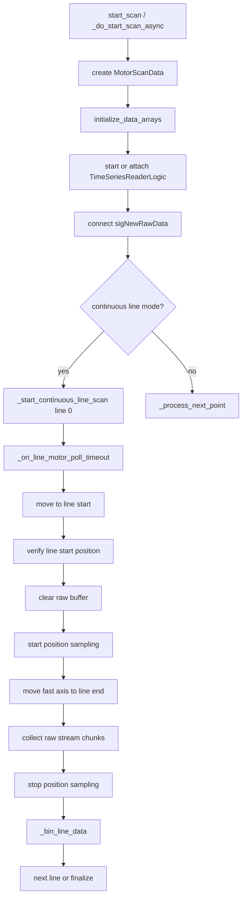
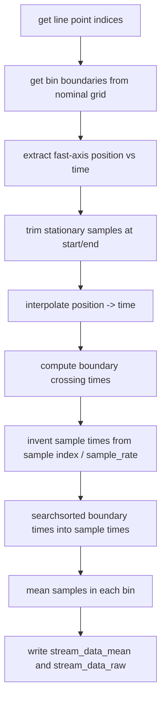

# Motor Scan Continuous Line Scanning

This document explains the continuous line scan path used by
`qudi.logic.motor_scan`. It is intended as a code-orientation document for
debugging recorded `CONTINUOUS_STREAM` and `CONTINUOUS_FREQ_TRACK` motor scans,
especially scans with Thorlabs MTS50/KDC101 stages and Red Pitaya streaming.

The relevant files are:

- `src/qudi/logic/motor_scan/scan_logic.py`
- `src/qudi/logic/motor_scan/continuous_line_scan.py`
- `src/qudi/logic/motor_scan/data_processing.py`
- `src/qudi/logic/motor_scan/data_structures.py`
- `src/qudi/logic/motor_scan/data_saving.py`
- `src/qudi/logic/motor_scan/motor_control.py`
- `src/qudi/logic/time_series_reader_logic.py`
- `src/qudi/hardware/motor/thorlabs_kdc101_kinesis.py`
- `src/qudi/hardware/redpitaya/redpitaya_data_instream.py`

## Concept

Continuous line scanning moves the motor continuously along the fast axis of
each line. The data stream is collected while the motor is moving and is binned
after the line finishes.

Unlike point-by-point scanning, the scan logic does not stop at each grid point.
It reconstructs which samples belong to which grid point from:

1. Encoder position samples collected during the line.
2. A constant-rate raw data stream.
3. The nominal grid positions and bin boundaries.

For a `LINE_BY_LINE_Y` scan:

```text
x line 0: move to (x0, y0) -> scan y0 to yN -> return to y0 at x1
x line 1: move to (x1, y0) -> scan y0 to yN -> return to y0 at x2
x line 2: move to (x2, y0) -> scan y0 to yN -> return to y0 at x3
...
```

For a `SNAKE_Y` scan, every second line scans in the reverse y direction, so the
long return move is avoided:

```text
x line 0: y0 -> yN
x line 1: yN -> y0
x line 2: y0 -> yN
...
```

## Module Structure

`MotorScanLogic` is assembled from mixins:

```text
MotorScanLogic
  ContinuousLineScanMixin  continuous line state machine
  MotorControlMixin        homing, movement, position sampling
  DataProcessingMixin      stream callbacks and line binning
  DataSavingMixin          saved maps, positions.dat, thumbnails
  DataLoadingMixin         loading saved data
```

The core call graph is:



## Scan Setup

The scan starts in `MotorScanLogic._do_start_scan_async()` in
`scan_logic.py`.

Main responsibilities:

- Resolve scan mode and scan pattern.
- Build a `MotorScanData` object.
- Initialize target positions and data arrays.
- Start or attach to `TimeSeriesReaderLogic` for stream modes.
- Connect `TimeSeriesReaderLogic.sigNewRawData` to
  `DataProcessingMixin._on_new_raw_data()`.
- Start either continuous-line scanning or point-by-point scanning.

For `CONTINUOUS_STREAM`, the code gets active time-series channel names and
creates:

```text
stream_data_mean[channel] -> 2D array, one mean per grid point
stream_data_raw[channel]  -> list of raw samples per grid point
actual_positions          -> one row per grid point
```

Important detail: `actual_positions` has the same shape as the nominal grid. In
the current continuous-line implementation it is not a saved copy of the raw
position sample trace.

## Line State Machine

Continuous line scanning is implemented in
`continuous_line_scan.py`.

The scan logic has two phases per line:

```text
Phase 1: Move to line start
  _start_continuous_line_scan()
  motor.move_abs(start_pos)
  timer polls _on_line_motor_poll_timeout()
  wait until motor reports idle
  verify actual position is within _LINE_START_POSITION_TOLERANCE

Phase 2: Scan to line end
  clear motor-scan raw data buffer
  set _line_data_start_time
  start position sampling
  motor.move_abs({fast_axis: line_end_fast_axis_position})
  timer polls while motor is moving
  stop position sampling
  copy current raw data buffer
  bin the line
```

ASCII timing sketch:

```text
time ------------------------------------------------------------->

move to line start      continuous fast-axis move        binning
|------------------|    |--------------------------|     |-----|

                        ^                          ^
                        |                          |
                        line data start            motor idle at line end
                        clear raw buffer
                        start position sampling
                        command line-end move

raw data callback:
                        [chunk][chunk][chunk][chunk][chunk]

position sampling:
                        p0    p1    p2    p3    p4    p5
```

The line-start verification tolerance is currently `500 um`. For scans with
sub-mm pixel spacing this tolerance can be larger than one pixel.

The Thorlabs hardware module has a `settle_time` option, but continuous line
scanning does not currently wait for that settle time after verifying the line
start and before starting the fast-axis line move.

## Position Sampling

Position sampling is implemented in `motor_control.py`.

Key methods:

- `_start_position_sampling(sample_interval_ms, preserve_buffer=False)`
- `_record_position_sample()`
- `_stop_position_sampling()`

The position buffer is a list:

```python
[(timestamp_seconds, {"x": x_position_m, "y": y_position_m}), ...]
```

Timestamps are relative to `_line_scan_start_time`, which is set when position
sampling starts. The timestamp is taken in software around the `get_pos()` call,
not from a hardware-synchronized clock.

Typical position sample rate is configured by `position_poll_interval` or
`position_sample_interval`, usually around 20 Hz. This is much slower than the
Red Pitaya data stream, so positions are used only to find boundary crossing
times, not to assign every stream sample directly.

## Raw Stream Data Flow

For `CONTINUOUS_STREAM`, data flows through these layers:

```mermaid
flowchart LR
    RP[Red Pitaya FPGA stream] --> RPHW[RedPitayaDataInStream]
    RPHW --> TSR[TimeSeriesReaderLogic]
    TSR -->|sigNewRawData(data_buffer, times_buffer)| MS[MotorScanLogic]
    MS --> BUF[_ts_raw_data_buffer]
    BUF --> BIN[_bin_line_data after line end]
    BIN --> MAP[stream_data_mean]
    BIN --> RAW[stream_data_raw per grid point]
```

In plain text:

```text
Red Pitaya scan module
  -> RedPitayaDataInStream software circular buffer
  -> TimeSeriesReaderLogic._acquire_data_block()
  -> TimeSeriesReaderLogic.sigNewRawData(data_view, times_view)
  -> MotorScanLogic._on_new_raw_data()
  -> MotorScanLogic._ts_raw_data_buffer[channel]
  -> _bin_line_data()
```

`TimeSeriesReaderLogic.sigNewRawData` emits the raw samples read from the
hardware streamer. The GUI trace processing, oversampling reduction, and moving
average happen inside TimeSeriesReaderLogic, but the signal received by motor
scan is the raw `data_view`.

For the Red Pitaya stream implementation in this repository:

- The sample timing is constant-rate.
- The hardware stream rate is fixed at approximately `125 MHz / 4096`, about
  `30517.6 Hz`.
- Timestamp buffers are not supported; reads return `None` for timestamps.
- A software circular buffer is used between FPGA polling and TimeSeriesReader.
- If the software buffer overflows, samples can be dropped and a warning is
  logged.

## Raw Data Callback

The motor scan receives raw data in
`DataProcessingMixin._on_new_raw_data(data_buffer, times_buffer)`.

For `CONTINUOUS_STREAM`, the callback:

1. Returns immediately unless the scan is running.
2. Gets `active_channel_names` from TimeSeriesReaderLogic.
3. Reshapes the interleaved raw buffer:

   ```text
   input:  [ch1_s0, ch2_s0, ch1_s1, ch2_s1, ...]
   output: channel -> [s0, s1, s2, ...]
   ```

4. Appends samples to `_ts_raw_data_buffer[channel]`.

The current implementation does not preserve per-sample timestamps in motor
scan and does not store `times_buffer`.

## Binning Algorithm

Line binning is implemented in
`DataProcessingMixin._bin_line_data()` in `data_processing.py`.

Inputs:

```text
line_index
position_time_buffer  software-timestamped encoder samples
raw_data_buffer       channel -> raw stream samples collected for this line
data_start_time       intended stream start reference
```

The binning stages are:



### Bin Boundaries

`MotorScanData.get_bin_boundaries()` creates `N + 1` boundaries for `N` grid
points along the fast axis.

For equally spaced positions:

```text
grid points:       p0       p1       p2       p3
boundaries:    b0      b1       b2       b3      b4
```

The internal boundaries are midpoints between grid points. The first and last
boundaries are extrapolated by half a step beyond the first and last grid point.

Example for positive direction:

```text
b0 = p0 - step/2
b1 = (p0 + p1) / 2
b2 = (p1 + p2) / 2
...
bN = pN-1 + step/2
```

For reverse direction the boundary positions are reversed, then boundary times
are sorted so sample indices are still increasing in time.

### Position -> Time Interpolation

The position samples are first trimmed to remove stationary samples at the
beginning and end of the line. This avoids repeated identical positions in the
position-to-time interpolation.

The code then builds a linear interpolation:

```text
fast-axis position -> timestamp
```

This is used to estimate when the motor crossed each bin boundary.

### Sample Times

For raw stream data, the current binning implementation does not use hardware
timestamps. It constructs sample times as:

```python
sample_times = np.arange(n_samples) / sample_rate
```

The `sample_rate` is currently taken from `ts_logic.data_rate` if available,
falling back to `30000.0`.

Important distinction:

```text
TimeSeriesReaderLogic.sampling_rate = hardware stream sample rate
TimeSeriesReaderLogic.data_rate     = sampling_rate / oversampling_factor
```

Because `sigNewRawData` emits raw samples, binning should use the raw sample
rate. If `oversampling_factor > 1` and binning uses `data_rate`, the sample time
axis is stretched by the oversampling factor.

### Assigning Samples to Bins

After boundary times are known, the code maps them to sample indices:

```python
boundary_sample_indices = np.searchsorted(sample_times, boundary_times)
```

For every grid point in the line:

```text
bin i samples = raw_array[boundary_sample_indices[i] :
                          boundary_sample_indices[i + 1]]
```

The mean of those samples is written to `stream_data_mean[channel][grid_idx]`.
The individual samples are written to `stream_data_raw[channel][point_idx]`.

## Saved Data

`DataSavingMixin.save_scan_data()` saves one map per stream channel and a
`positions.dat` file.

For stream maps:

```text
ch1.dat
ch1.pdf
...
positions.dat
```

The stream map is the binned mean data array. For 2D scans, arrays are shaped as
`(nx, ny)`, meaning the first index is x and the second index is y.

### Important Limitation of positions.dat

In the current continuous-line implementation, `actual_positions` is filled in
`_bin_line_data()` with nominal line grid positions:

```text
actual_positions[point_idx, axis] = target grid position
```

That means `positions.dat` reports zero position error even if the line had
real timing, interpolation, or position-sampling errors. It is not a valid
encoder-error diagnostic for continuous line scans in the current code.

## Key Methods

### `scan_logic.py`

- `_do_start_scan_async(axes)`
  - Creates the scan data object.
  - Initializes data arrays.
  - Starts or attaches to TimeSeriesReaderLogic.
  - Connects raw stream data signals.
  - Starts continuous-line mode if enabled.

- `_finalize_scan(completed)`
  - Disconnects time-series signals.
  - Stops TimeSeriesReaderLogic if motor scan started it.
  - Saves data automatically if configured.

### `continuous_line_scan.py`

- `_start_continuous_line_scan(line_index)`
  - Gets line start and end positions.
  - Commands move to line start.
  - Starts polling for line-start arrival.

- `_on_line_motor_poll_timeout()`
  - Main continuous-line state machine.
  - Handles line-start verification.
  - Starts position sampling.
  - Commands fast-axis line move.
  - Stops sampling at line end.
  - Calls `_bin_line_data()`.
  - Starts next line or finalizes scan.

- `_resume_continuous_line()`
  - Resumes a paused line.
  - Uses `_position_sample_interval` rather than `_position_poll_interval`.

### `motor_control.py`

- `_start_position_sampling()`
  - Clears or preserves the position sample buffer.
  - Starts software timer for position sampling.

- `_record_position_sample()`
  - Reads current motor position.
  - Appends `(timestamp, position)` to the line position buffer.

- `_stop_position_sampling()`
  - Stops the timer.
  - Records one final position sample.
  - Returns a copy of the position buffer.

### `data_processing.py`

- `_connect_time_series_signals()`
  - Connects TimeSeriesReaderLogic raw data signal.

- `_on_new_raw_data(data_buffer, times_buffer)`
  - Receives stream data chunks during the scan.
  - Splits interleaved samples by channel.
  - Appends raw samples to `_ts_raw_data_buffer`.

- `_bin_line_data()`
  - Converts position samples into boundary crossing times.
  - Constructs sample times from sample index and sample rate.
  - Bins raw samples into grid points.

- `_clear_line_raw_data_buffer()`
  - Clears the motor scan copy of the raw stream buffer.
  - Does not drain TimeSeriesReaderLogic or Red Pitaya hardware/software
    buffers.

### `data_structures.py`

- `MotorScanData.get_flat_target_positions()`
  - Builds the ordered scan path from range, resolution, and pattern.

- `MotorScanData.point_index_to_grid_index()`
  - Converts scan-order point index to `(ix, iy)` grid index.

- `MotorScanData.get_line_start_end_positions()`
  - Returns the start and end position dictionaries for a line.

- `MotorScanData.get_bin_boundaries()`
  - Returns fast-axis bin boundaries for a line.

## Timing Assumptions

Continuous line binning currently assumes:

1. The raw data buffer for a line starts exactly when position sampling starts.
2. The first raw sample corresponds to `t = 0` in the position buffer.
3. No pre-line or stale samples arrive after the motor scan raw buffer is
   cleared.
4. No raw samples are dropped in the Red Pitaya or TimeSeriesReader path.
5. The sample rate used in binning matches the emitted raw samples.
6. Software position timestamps are accurate enough for boundary interpolation.
7. The motor line-start position is close enough that any residual error is
   negligible compared with the pixel pitch.

If any of these assumptions is wrong, line-wise spatial shifts can appear even
when the mechanical stage is positioning well.

## Debugging Checklist

When investigating line artifacts, record or inspect:

- Scan mode, pattern, axes, range, resolution, and velocity.
- TimeSeriesReaderLogic `sampling_rate`, `data_rate`, and `oversampling_factor`.
- Red Pitaya stream sample rate and buffer overflow warnings.
- Whether TimeSeriesReaderLogic was already running before the scan.
- Number of raw samples collected per line.
- Number of samples assigned to each bin.
- Empty or unusually small bins.
- Line start target and measured line start position.
- Line end target and measured line end position.
- First and last position samples per line.
- First and last raw data sample timestamps, if a future stream source supports
  them.
- Time between line-start verification, raw-buffer clear, position sampling
  start, and fast-axis move command.

## Known Weak Points in the Current Implementation

- `positions.dat` stores nominal positions for continuous line mode, not real
  measured/interpolated positions.
- `times_buffer` from TimeSeriesReaderLogic is ignored by motor scan.
- Red Pitaya stream currently has constant-rate samples but no timestamp buffer.
- Binning uses `ts_logic.data_rate`, which is not the raw sample rate when
  oversampling is active.
- `_line_data_start_time` is passed into `_bin_line_data()` but no nonzero time
  offset is applied.
- Clearing `_ts_raw_data_buffer` does not drain lower-level stream buffers or
  remove already-queued Qt signal deliveries.
- The line-start tolerance is coarse compared with sub-mm pixel pitch.
- No per-line diagnostics are saved, so many timing errors cannot be
  reconstructed from saved `ch*.dat` and `positions.dat` files.

## Practical Mental Model

Think of each line as two independent clocks that the code tries to line up
after the fact:

```text
Motor clock:
  software timestamp -> encoder position -> boundary crossing times

Data clock:
  raw sample index -> sample time from assumed sample rate

Binning:
  boundary crossing times -> sample index ranges -> mean per grid point
```

The continuous-line scan is only as accurate as the alignment between these two
clocks. For Red Pitaya scans with no hardware timestamps, alignment depends on
starting from a clean buffer at the line start and using the correct raw sample
rate.
